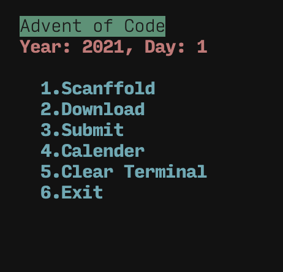

# advent-of-code (Rust)



## Usage

```bash
# Create the scaffolding for a new day (must run before download.sh)
./run.sh <year> <day>
```

## Thanks

- [Advent of Code](https://adventofcode.com/)
- [fspoettel/advent-of-code-2021](https://github.com/fspoettel/advent-of-code-2021)
